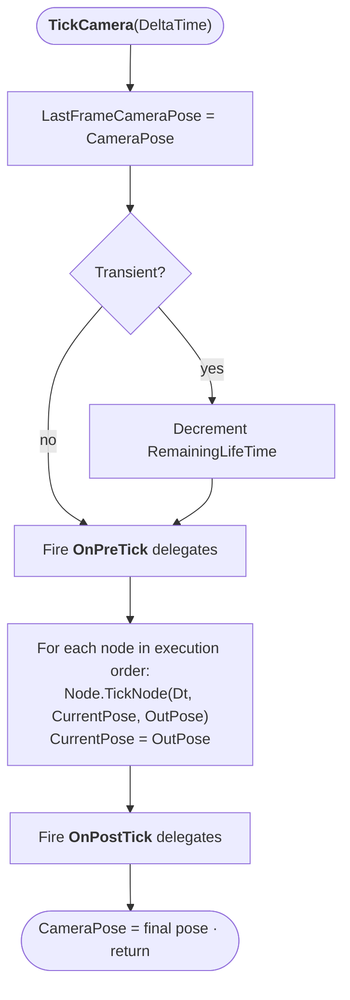

# Evaluation Tree

The Evaluation Tree is **Tier 2**: it produces a single pose per frame for one context by composing and blending cameras. Every active [Context](context-stack.md) has its own Director, and every Director owns exactly one Evaluation Tree.

## The Director

A Director is a thin manager sitting above the tree. It tracks:

- the **running camera** (the current rightmost leaf — the one the player is ultimately being handed off to),
- the **last evaluated pose** (what the player just saw), and
- the **previous evaluated pose** (what the player saw the frame before).

The last two are important because transitions use `(Last - Previous) / DeltaTime` to recover an initial velocity when they start — which is what makes inertialized transitions feel physically plausible (see [Transitions](transitions.md)).

Directors don't blend on their own. They delegate to the tree.

## Three node types

Tree nodes come in exactly three shapes:

- **Leaf** — wraps one `AComposableCameraCameraBase`. Evaluating it ticks the camera (walking its ordered node list) and returns the camera's pose.
- **Reference leaf** — wraps a `UComposableCameraDirector*` from *another* context. Evaluating it calls that other Director's `Evaluate()` and returns whatever pose comes back. Used only during inter-context transitions; see [Context Stack](context-stack.md#inter-context-transitions-why-the-old-context-keeps-evaluating).
- **Inner node** — wraps a `UComposableCameraTransitionBase*` and owns two children (left = source, right = target). Evaluating it evaluates both children first, then asks the transition to blend the two resulting poses.

A brand-new Director has a tree of just one leaf (the initial camera). That single leaf is also the running camera.

## How the tree grows when you activate a camera

When you call `Activate Composable Camera` on an already-active context, the tree is rewritten in place. The exact rewrite depends on whether a transition is resolved for the pair (see [Transitions](transitions.md#the-five-tier-resolution-chain)).

**With a transition** (the common case):

```
Before:          After:
 [CamA]          [Inner: Transition]
                  /              \
              [CamA]           [CamB]
              (source)         (target)
```

The old tree becomes the left subtree. A new leaf wrapping the target camera becomes the right subtree. A new inner node (holding the resolved transition) becomes the root. Future activations during an in-progress transition keep grafting onto the left — the old tree slides further left as new cameras arrive on the right.

**Without a transition** (hard cut):

```
Before:          After:
 [anything]      [CamB]
```

The entire old tree is destroyed and replaced with a single leaf for the new camera.

**With a reference source** (the inter-context case):

```
 [Inner: Transition]
  /              \
[RefLeaf: OldDir]  [CamB]
```

The left child is a reference leaf pointing at the Director that just got popped; the right is the resumed camera. The transition runs just like any other transition — it doesn't know or care that its left input comes from a different context.

## The collapse rule — why trees stay small

After evaluation each frame, the system calls `CollapseFinishedTransitions` on the root. The rule is:

- **Inner node whose transition is finished** → destroy the left subtree's cameras, promote the right subtree, and fire `OnTransitionFinishesDelegate` (which e.g. tears down `PendingDestroyEntries` for the cross-context case). The inner node is replaced by its right child.
- **Inner node whose transition is not yet finished** → recurse into the left subtree only. The right subtree is the target — it's the one "we're heading to" and it should remain stable. But the left might itself be a chain of inner nodes from rapid-fire activations, and any of *those* that have finished should collapse.
- **Leaf or reference leaf** → nothing to do.

The effect is a "right grows, left collapses" pattern. The rightmost path always leads to the running camera. The tree never grows unbounded even under pathological activation sequences — finished blends are reaped on the very next frame.

## Node-inside-camera evaluation

A leaf's `Evaluate()` calls `Camera->TickCamera(DeltaTime)`, which walks the camera's node list:



Nodes are sequential: each one reads the pose produced by the previous, applies its logic, and writes a modified pose. They also communicate through a typed pin system (`GetInputPinValue<T>` / `SetOutputPinValue<T>`) routed through the camera's flat `RuntimeDataBlock` — so one node can publish "the pivot position this frame" and a downstream node can read it, without either node knowing about the other's existence.

For the full node lifecycle — per-activation `OnInitialize` hooks, compute nodes that run once at `BeginPlay`, subobject pin exposure — see the [DesignDoc](https://github.com/littlesulley/ComposableCameraSystem/blob/dev-v1/Docs/DesignDoc.md) §7.

## GC and ownership

Tree nodes are held by `TSharedPtr`, but the UObjects inside them (cameras, transitions) are exposed to Unreal's garbage collector through the tree's `AddReferencedObjects` walker. Cameras that get orphaned when a transition finishes are explicitly `DestroyActor`ed — the tree does not rely on GC for timely cleanup of camera actors.

## In summary

A Director's Evaluation Tree is a binary tree whose leaves produce poses and whose inner nodes blend poses. Activating a new camera rewrites the tree by inserting a new inner node at the root. Finished transitions collapse themselves one frame later. The tree never inspects what's inside its children — it only sees poses — which is why transitions generalize across contexts without special-casing.

Next: [what transitions actually do between those two input poses](transitions.md).
