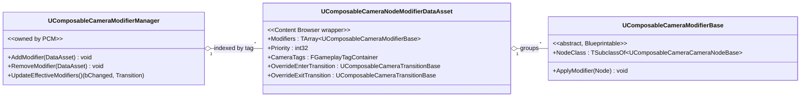

# Modifiers

A modifier is a runtime-added override that targets a specific **node class** and alters that node's parameters before it ticks. Modifiers let you change how the current camera behaves without creating a new camera type or editing the active type asset.

Examples of things modifiers are good for:

- Halving the `LookAtNode`'s look-at weight during a stunned state.
- Pushing `FieldOfViewNode`'s FOV by +10° during a sprint.
- Disabling `CollisionPushNode` for a boss-room flyover, then re-enabling it on exit.
- Temporarily swapping `ControlRotateNode`'s input-rate multiplier during a zoomed aim.

Modifiers do **not** add or remove nodes — they only tweak the parameters of nodes that are already part of the active camera.

## Not Unreal's `UCameraModifier`

If you've used UE's built-in `UCameraModifier`, the names are similar but the level of the system is different. UE's modifiers sit at the Player Camera Manager level and post-process the final view. ComposableCameraSystem's modifiers sit *underneath* the PCM's final output — they target individual nodes inside the active camera, before its evaluation runs.

In practice that means:

- UE's modifiers run last and see only the finished pose.
- ComposableCameraSystem modifiers run first, at the per-node parameter level, and every node downstream sees their effect.

The two are not interchangeable and don't interact.

## Architecture at a glance



- **`UComposableCameraModifierBase`** is an abstract, `Blueprintable` class. You subclass it (C++ or Blueprint), set `NodeClass` on the **Class Default Object**, and implement `ApplyModifier` to mutate that node's parameters. The base class has no `Priority` field and no camera-scoping metadata — those live on the wrapper.
	![[assets/images/Pasted image 20260416215332.png]]
	![[assets/images/Pasted image 20260416220927.png]]
- **`UComposableCameraNodeModifierDataAsset`** is the Content-Browser-resident wrapper. It groups one or more modifier instances together and attaches routing metadata: priority (higher wins), camera tags (which cameras this group applies to), and optional enter/exit transition overrides for the reactivation blend. Registered with a purple color + custom thumbnail under "Composable Camera System".
	![[assets/images/Pasted image 20260416221011.png]]
- **`UComposableCameraModifierManager`** is created by the PCM and is the single source of truth for which modifier groups are active. It indexes them by gameplay tag, computes the effective modifier per `(camera, node class)` pair, and drives reactivation when the effective set changes.
![[assets/images/Modifier.gif]]
!!! warning "Non-transient cameras only"
    Modifier resolution is skipped for transient cameras (activated with `bIsTransient = true` on `FComposableCameraActivationParams`). Cinematic intros and short-lived overlays are typical transient cameras — if you need them modifier-aware, clear `bIsTransient`.

## Priority — one group wins per (camera, node class)

When two modifier groups (`UComposableCameraNodeModifierDataAsset`s) both target the same camera (by gameplay tags) and both contain a modifier for the same `NodeClass`, **only the higher-`Priority` group's modifier is active for that node class**. Priority is an `int32` clamped to `≥ 0` declared on the data asset wrapper, not on the base modifier class.

If you stack a "sprint FOV +10°" group and a "stunned FOV −20°" group on `FieldOfViewNode`, you don't get +10 − 20 = −10; you get whichever group has the higher `Priority`. If you want additive effects on the same node class, author a single modifier that folds the logic into one `ApplyModifier` call — or split the effects onto different node classes (e.g. `FieldOfViewNode` and a dedicated `ZoomNode`), so each wins its own class-level contest independently.

The resolution is *per (camera, node class)* — the same priority number can win on `FieldOfViewNode` and lose on `ControlRotateNode` simultaneously. The "effective modifier" map is recomputed in `FComposableCameraModifierData::UpdateEffectiveModifiers` whenever the active set changes.

## Reactivation on modifier changes

When the effective modifier for the running camera's node class changes (either because a group was added, removed, or because the priority ordering shifted), the system doesn't just "re-read" parameters on the live node — it performs a **seamless reactivation**:

1. `UpdateEffectiveModifiers` returns a `(bChanged, Transition*)` pair to the PCM.
2. If `bChanged` is false, nothing happens.
3. If true, a fresh camera of the same type is spawned, and the old camera is transitioned away using the returned transition, resolved through this chain:
    1. If adding → `OverrideEnterTransition` on the incoming group, if set.
    2. If removing → `OverrideExitTransition` on the outgoing group, if set.
    3. Otherwise → the [five-tier resolution chain](transitions.md#the-five-tier-resolution-chain), starting from the target camera's `EnterTransition`.

From the player's perspective this looks like a short, clean blend into a camera that now behaves with the new modifier applied. The override fields on the data asset give modifier authors a surgical tool for "when this effect is added/removed, blend differently than the camera's default" — without forcing a transition table entry at every call site.

The reactivation path shares the same infrastructure as all other type-asset activations — it reads `SourceTypeAsset` and `SourceParameterBlock` off the running camera, restores them into `PendingTypeAsset` / `PendingParameterBlock`, and calls through `OnTypeAssetCameraConstructed` to rebuild the new camera's node list, runtime data block, and exec chains. Nothing about this path is modifier-specific; it's the general "same camera, fresh instance" path.

## Adding and removing modifiers at runtime

Modifier groups are added and removed as `UComposableCameraNodeModifierDataAsset`s, not as raw modifier instances. The wrapper is the unit of management — individual modifier instances inside a group are never directly registered with the manager.

From Blueprint, use the `Add Modifier` and `Remove Modifier` nodes on `UComposableCameraBlueprintLibrary`. Both take a world-context object, a resolved `AComposableCameraPlayerCameraManager*`, and the `UComposableCameraNodeModifierDataAsset` to add or remove.
![[assets/images/Pasted image 20260416221905.png]]

From C++, prefer the Blueprint library over poking the manager directly — you still need to resolve the PCM yourself:

```cpp
AComposableCameraPlayerCameraManager* PCM =
    UComposableCameraBlueprintLibrary::GetComposableCameraPlayerCameraManager(WorldContext, /*PlayerIndex*/ 0);
UComposableCameraBlueprintLibrary::AddModifier(WorldContext, PCM, SprintModifierAsset);
// later...
UComposableCameraBlueprintLibrary::RemoveModifier(WorldContext, PCM, SprintModifierAsset);
```

If you already have a PCM reference and want to bypass the library:

```cpp
PCM->ModifierManager->AddModifier(SprintModifierAsset);
PCM->ModifierManager->RemoveModifier(SprintModifierAsset);
```

Modifier groups can be added and removed at any time — the manager handles the reactivation machinery on your behalf.

## Scoping — which cameras a group applies to

Modifier groups are scoped to cameras by **gameplay tags**, not by context or camera identity. Every camera carries an `FGameplayTagContainer` declared on its type asset; every `UComposableCameraNodeModifierDataAsset` carries its own `CameraTags` container. When adding a group, the manager considers it for a camera only if the camera's tag set matches.

- Matching is `FGameplayTagContainer::HasAny`, not `HasAll` — a group tagged `Gameplay.ThirdPerson` applies to any camera that carries `Gameplay.ThirdPerson`, even if the camera carries additional tags.
- Empty `CameraTags` means "applies to all cameras". Use sparingly — it's an easy way to accidentally tweak a cutscene camera.
![[assets/images/Pasted image 20260416222021.png]]
Gameplay code still manages lifetime: you add the group when the condition starts (sprint begins, stun effect lands, aim held) and remove it when the condition ends. The tag system decides *which cameras* the group affects; gameplay decides *when* it's active.

For one-shot, camera-scoped overrides (e.g. "only while this camera is running"), prefer [Actions](actions.md) instead, which expire automatically when a camera transitions away.

## In summary

- Modifier instances target a **node class**; modifier groups (`UComposableCameraNodeModifierDataAsset`) wrap them with priority, camera tags, and override transitions.
- **Highest-priority group wins** per `(camera, node class)`; there's no stacking.
- Camera tags decide *which* cameras a group applies to (`HasAny` matching); gameplay decides *when* the group is active.
- Adding, removing, or changing the effective modifier triggers a **seamless reactivation** of the running camera, not a live-property patch. The group's `OverrideEnterTransition` / `OverrideExitTransition` can customize that blend.
- Modifiers are skipped for transient cameras — clear `bIsTransient` if a cinematic needs to be modifier-aware.
- They sit below the PCM's final output, affecting node parameters before evaluation — unrelated to Unreal's built-in `UCameraModifier`.

Next: [lightweight, self-expiring per-frame behaviors via Actions](actions.md).

## Further reading

From here:

- If you want to start authoring, jump to [Authoring Camera Types](../authoring-camera-types.md).
- If you want the full catalog of shipped nodes/transitions/modifiers, see [Reference](../../reference/index.md).
- If you want to write your own nodes/transitions/modifiers, see [Extending](../../extending/index.md).
