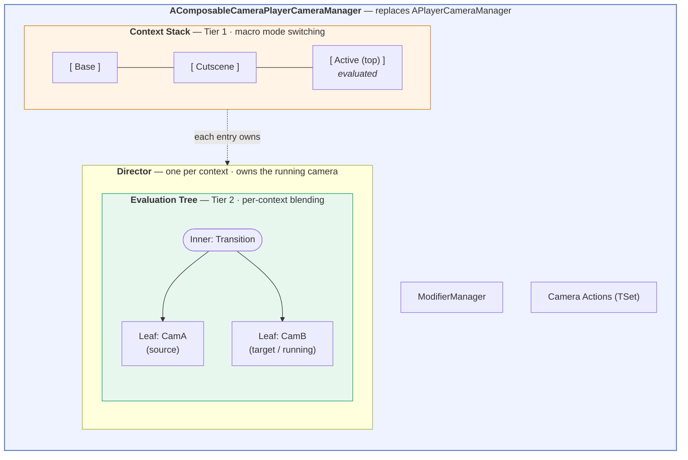
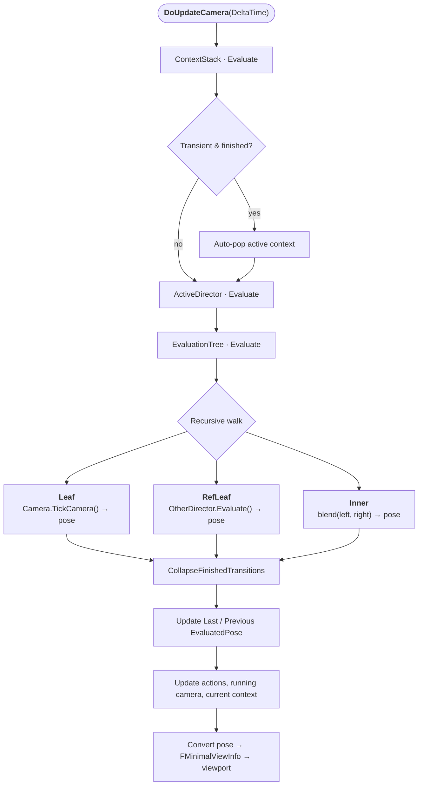

# Architecture Overview

Every frame, your player sees the output of one logical camera — a single pose (position, rotation, FOV, projection, physical-lens parameters) applied to the viewport. ComposableCameraSystem produces that pose by running a layered pipeline. This page walks the layers from outermost to innermost.

## The layered picture

Read it top-down:

- **Player Camera Manager (PCM)** sits where Unreal's `APlayerCameraManager` would — it's a subclass (`AComposableCameraPlayerCameraManager`) that every interested PlayerController points at via `PlayerCameraManagerClass` (see [Enabling the Plugin](../../getting-started/enabling-plugin.md)). It owns everything below it and drives the per-frame loop.
- **Context Stack** is a LIFO stack of named contexts (`Gameplay`, `Cutscene`, `UI`, …). Only the top context is evaluated each frame. Pushing a new context suspends everything below without tearing it down. Context names are registered in `UComposableCameraProjectSettings::ContextNames`; the first entry is the base context and is initialized before any actor's `BeginPlay`.
- **Director** is per-context. It owns an Evaluation Tree, tracks the currently-running camera, and remembers the last two evaluated poses — which transitions use for velocity calculations (see [Transitions](transitions.md)).
- **Evaluation Tree** is a binary tree of leaves (wrapping a Camera) and inner nodes (wrapping a Transition). Leaves produce poses; inner nodes blend two poses into one.
- **Camera** is an `AComposableCameraCameraBase` actor that owns an ordered array of Camera Nodes. It's data-driven: the actor is a container, not a subclass hierarchy.
- **Camera Node** is a single-responsibility operator. It reads the input pose, applies its logic, and writes an output pose. Nodes also talk to each other through a typed pin system routed by a flat `RuntimeDataBlock`.
- **Transition** is a pose-only blender. Each frame it receives two input poses (source and target) and outputs one blended pose. It never references the source/target cameras directly.
- **Modifier** targets a specific *node class* and overrides its parameters at runtime. Highest priority wins; changes may trigger a seamless camera reactivation.

## What happens on one frame

Once per frame, `AComposableCameraPlayerCameraManager::DoUpdateCamera(DeltaTime)` drives this sequence:

The recursive tree walk is the heart of the system. A leaf produces a pose by ticking its camera (which itself walks its ordered node list). An inner node produces a pose by blending its two children. A reference leaf produces a pose by evaluating a different Director entirely — that's how a gameplay camera keeps animating live while a cutscene is blending in on top.

After the pose comes out, `CollapseFinishedTransitions` walks the tree one more time and promotes any inner node whose transition is done, so the tree stays small.

## Where each subsystem is explained

- The LIFO, push/pop semantics, auto-pop for transient cameras, and inter-context resume → [Context Stack](context-stack.md).
- Tree shape, activation rewrites, reference leaves, the collapse rule → [Evaluation Tree](evaluation-tree.md).
- Lifecycle (`TransitionEnabled → OnBeginPlay → OnEvaluate → OnFinished`), velocity-aware inertialization, the five-tier resolution chain → [Transitions](transitions.md).
- Priority-per-node-class, reactivation with transition, the difference from UE's built-in `UCameraModifier` → [Modifiers](modifiers.md).

If you want the full internal reference — invariants, node lifecycle in detail, the `RuntimeDataBlock` pin system, subobject pin exposure, inertialization polynomials — that lives in the plugin's [DesignDoc](https://github.com/littlesulley/ComposableCameraSystem/blob/dev-v1/Docs/DesignDoc.md). This user-facing section is the shorter, non-internals version.
