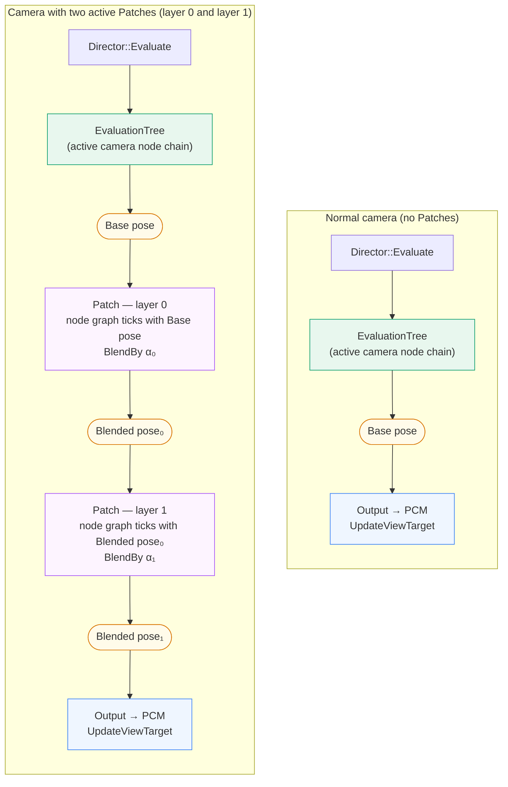
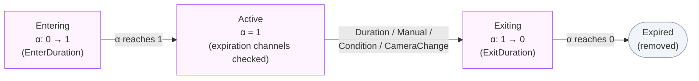

# Camera Patches

Camera Patches are short-lived, additively-composable overlays that sit **above** the normal camera evaluation tree. The Director evaluates the active camera's node chain first to produce a base pose; Patches then run in layer order on top of it — each Patch reads the upstream pose, runs its own node graph, and contributes a blended result.

Use a Patch when you need a temporary, time-bounded effect that overlays the running camera without changing its configuration: a hit-reaction shake, a scope-zoom push, a recoil impulse, or any gameplay-triggered effect that should fade in, do its job, and fade out.

## Per-frame evaluation flow

The diagram below shows what happens inside one `Director::Evaluate` call — first without any Patches, then with two active Patches.

Key points from the diagram:

- The EvaluationTree runs **unconditionally** — Patches never replace it, only layer on top.
- Each Patch receives the **previous layer's output** as its upstream pose, so Patches compose in a defined chain rather than a random pile.
- **α** is the Patch's current envelope alpha (0 → 1 entering, 1 active, 1 → 0 exiting). A Patch at α = 0 contributes nothing; `BlendBy` makes this a no-op rather than a sudden switch.
- The PatchManager runs the full loop (advance envelope → check expiration → tick evaluator → BlendBy → sweep expired) **inside** `Director::Evaluate`, just after the tree.

## The four tools compared

| | Node | Action | Modifier | Patch |
|---|---|---|---|---|
| **Part of the permanent chain** | Yes | No | No | No |
| **Runs its own node graph** | Yes | No | No | Yes |
| **Has enter/exit envelope** | No | No | No | Yes |
| **Layered by index (multiple at once)** | No | No | No | Yes |
| **Works in Sequencer timeline** | No | No | No | Yes |

Actions fill the "per-frame logic, no graph" niche. Patches fill the "full node graph, time-bounded, envelope-blended" niche. When the effect is complex enough to need its own graph (e.g. a spring-damped offset that references a pivot actor), a Patch is the right tool.

## Lifecycle

Every Patch instance passes through four phases:

The easing curve (`EComposableCameraPatchEase`: Linear, EaseIn, EaseOut, EaseInOut, Smooth) is applied symmetrically to both ramps. `EnterDuration ≤ 0` short-circuits directly to Active on the first frame — no invisible α = 0 frame is wasted.

## Expiration channels

A Patch can expire through any combination of:

- **Duration** — after a fixed number of seconds in the Active phase.
- **Manual** — when `ExpirePatch(handle)` is called explicitly.
- **Condition** — when the asset's `CanRemain()` override returns `false`.
- **OnCameraChange** — when the Director's running camera changes (per-call flag on `FComposableCameraPatchActivateParams`).

The first channel to fire flips the Patch to Exiting via the exit envelope ramp. Channels stack additively.

## Two surfaces

Patches are designed to work from two independent surfaces:

- **Blueprint / C++ runtime path** — `AddCameraPatch` on the active Director, driven by gameplay events. Suitable for dynamic, event-driven effects whose timing isn't known ahead of time.
- **Sequencer timeline path** — a `UMovieSceneComposableCameraPatchTrack` on a Level Sequence, driving a `UComposableCameraLevelSequenceActor`. Suitable for authored cinematic overlays whose timing is locked to the timeline.

The two surfaces are orthogonal: a gameplay Patch applies on the PCM Director's running camera, while a Sequencer Patch applies on the LS Actor's internal CineCamera. Both can be active simultaneously without interfering.

For the full authoring guide, see [User Guide → Camera Patches](../camera-patches.md).
