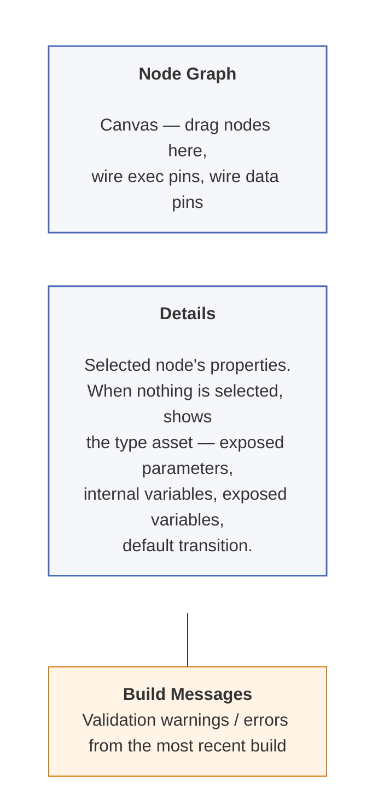

# The Graph Editor

The camera type asset editor is a bespoke `UEdGraph` — it looks like Unreal's Blueprint graph but runs on a custom schema with custom nodes, custom pin rules, and a custom sync/rebuild pipeline. This page is the visual tour.

## Layout

Opening a `UComposableCameraTypeAsset` lands you in a three-pane layout:

There is intentionally no separate **Parameters** tab. Exposed parameters, internal variables, and the default transition all live on the type asset, so they're editable directly in the Details panel whenever graph selection is empty. Clicking any node overwrites that view with the selected node's properties; clicking the empty canvas brings the asset view back.
![[assets/images/Pasted image 20260416222204.png]]
## The two exec chains

Every camera graph has **two** execution chains, each rooted at its own sentinel:

- **Camera chain** — rooted at the main `Start` sentinel, terminating at `Output`. Runs every frame, producing the pose for this camera.
- **BeginPlay compute chain** — rooted at the `BeginPlay Start` sentinel, with no terminator. Runs exactly once at camera activation and publishes results that camera-chain nodes consume each frame.

The two sentinels are always present (they're spawned by `CreateDefaultNodesForGraph` and cannot be deleted). Camera nodes belong to the camera chain; compute nodes (subclasses of `UComposableCameraComputeNodeBase`) belong to the compute chain. The schema refuses exec wires that would cross between the two.

Variable Set nodes are the one exception — they classify themselves dynamically based on whichever exec chain they're wired into, and Variable Get nodes are pure data conduits without exec pins so they can be read from either chain.

## Node visuals

Each node on the canvas carries:

- **Title bar** — the resolved display name (e.g. "Receive Pivot Actor") plus an enable/disable toggle. Hover for a one-line tooltip describing the node's purpose.
- **Exec pins** — white triangles on the top-left (in) and top-right (out). One per node, one line, no branches.
- **Data pins** — coloured circles on the left (input) and right (output). One per pin declared by the node, coloured by type.
- **Exposed pins** — input pins that have been exposed as camera parameters. They render with a muted grey connector, ignore hover highlights, and refuse wire connections. Right-click and pick **Unexpose Parameter** to turn them back into wireable pins.
- **Error/warning badges** — if the most recent build produced validation issues for this node, icons appear beside the affected pins.

### Pin colour legend

The schema assigns a colour per pin type, roughly following UE's Blueprint conventions:

| Type | Colour |
|---|---|
| Bool | Dark red |
| Int32 | Teal |
| Float | Green |
| Double | Light green |
| Vector2D | Gold |
| Vector3D | Yellow |
| Vector4 | Orange |
| Rotator | Blue-violet |
| Transform | Orange-red |
| Actor | Blue |
| Object | Cyan |
| Struct | Dark magenta |

Float and Double are interchangeable — you can wire a Float output into a Double input without casting, and vice versa.

## Palette and context menu

Right-click on the canvas to open the context menu. Entries are grouped:

- **Camera Nodes** — every non-abstract `UComposableCameraCameraNodeBase` subclass. Includes built-in nodes and any Blueprint-authored nodes in the project.
- **Compute Nodes** — the BeginPlay chain counterparts. Built-ins include `ComputeRandomOffsetNode` and `ComputeDistanceToActorNode`.
- **Variables → Get → Internal / Exposed → {var}** — one entry per declared variable.
- **Variables → Set → Internal / Exposed → {var}** — one entry per declared variable, with the additional exec pins Set nodes carry.
![[assets/images/Pasted image 20260416222309.png]]
If the context menu was opened by dragging off a pin, the menu filters to only nodes that can accept (or produce) a compatible wire, and auto-wires the new node to the dragged pin on placement.

## Wiring rules

The schema's `CanCreateConnection` enforces, in order:

1. **Output → input only.** Output-to-output and input-to-input are rejected.
2. **Exec to exec, data to data.** No mixing.
3. **One exec chain per node.** A camera-chain exec wire cannot connect to a compute-chain node.
4. **One source per input pin.** Wiring a new output into an already-connected input breaks the old wire first.
5. **Many consumers per output.** An output pin can fan out to any number of inputs.
6. **Type compatibility.** Same pin category; structs must share `UScriptStruct`; object pins follow inheritance.
7. **Exposed pins refuse wires.** An input pin that's exposed as a camera parameter cannot be wired until you unexpose it.
8. **Variable-to-variable wires are rejected.** Variable Get/Set nodes must connect to camera-node pins, not to each other.

When a wire is rejected, the cursor shows a red circle and the reason appears in a tooltip.

## The Details panel

The Details panel has two modes, toggled by graph selection:

**Node selected.** Shows the node's `UPROPERTY` fields. For a node with `Instanced` subobjects (e.g. `CollisionPushNode`'s `PushInterpolator` and `PullInterpolator`), the subobject's class picker is shown but individual child properties are hidden — those flow through the subobject pin system instead. See the [Concepts → Subobject Pins](concepts/overview.md) note for why.

**Nothing selected.** Shows the type asset itself:

- **Exposed Parameters** — the list of currently-exposed pins. The array is `EditFixedSize` (no Add/Remove buttons) because the only legal way to add an entry is to expose a pin in the graph. You can edit the per-entry `DisplayName`, `Category`, `Tooltip`, and `bRequired` directly here.
- **Internal Variables** — the array of internal variables. Add, rename, retype, or delete entries inline. Typed value editing uses a widget matching each variable's type (checkboxes for Bool, numeric spinners for Float/Double, multi-component editors for vectors, a structure view for USTRUCT types). Renaming or retyping propagates to every Get/Set node referencing the variable via the variable's stable `FGuid`.
- **Exposed Variables** — same as internal variables, but callers can override the initial value at activation.
- **Default Transition** — the `EnterTransition` (instanced `UComposableCameraTransitionBase*`) used when this camera type is activated without a caller-supplied override.

## Keyboard and mouse

- **Select** — click a node. `Ctrl+A` selects all.
- **Move** — left-click drag.
- **Delete** — `Delete` key, or right-click → Delete. Start/Output sentinels refuse deletion. All removals are undoable via `Ctrl+Z`.
- **Wire** — click an output pin, drag onto an input pin. Drop on empty canvas to open the filtered context menu.
- **Break wire** — `Alt+click` the target end of a wire, or right-click the pin → Break All Pin Links.
- **Duplicate** — `Ctrl+D`, or right-click → Duplicate. Wires are not preserved across duplication.
- **Expose / Unexpose pin** — right-click an input pin → Expose as Camera Parameter / Unexpose Parameter.

Every mutation (node add/delete, wire add/break, detail-panel edit) is wrapped in an `FScopedTransaction`, so `Ctrl+Z` and `Ctrl+Shift+Z` cover the full editing surface.

## Build pane

Saving the asset (`Ctrl+S`) runs the Build pass. Results appear in the **Build Messages** tab at the bottom. Errors block nothing (the asset still saves), but they indicate configuration that will fail at runtime:

- Required exposed parameters with no `DisplayName` set.
- Internal / exposed variables with no `InitialValueString` that will default-construct.
- Data pins whose wire has been invalidated (e.g. a node was deleted after the wire was drawn).
- Compute nodes with no incoming exec wire (will never run at BeginPlay).
- Nodes with no exec wire at all (will be silently skipped at runtime — usually a mistake).

Clicking a message jumps selection to the offending node, so the "find and fix" loop is Alt+Tab between Build Messages and Node Graph.

## Round-trip: why the graph is the source of truth

The type asset stores two kinds of data:

- **Durable fields** — `NodeTemplates`, `ExposedParameters`, `InternalVariables`, `ExposedVariables`, `PinConnections`, `FullExecChain`, layout metadata. These are serialized with the asset and are what the runtime reads at activation.
- **The EdGraph** — `Transient`, rebuilt every time the editor opens the asset. It is a pure derived view.

`SyncToTypeAsset` writes from the graph into the durable fields whenever the graph changes. `RebuildFromTypeAsset` reconstructs the graph from the durable fields on editor open. The invariant is that any graph state that isn't captured in the durable fields will not survive a close-and-reopen — so if you find yourself asking "where is this stored?", the answer is always "somewhere in the durable fields, or it's ephemeral".

The practical effect: edits inside the editor are safe to experiment with (the graph is the live working copy), saves flush into the asset, and reopening reconstructs the graph from the asset. Collaborators working from version control see the serialized asset — no `.uasset` merge pain from graph layout.
