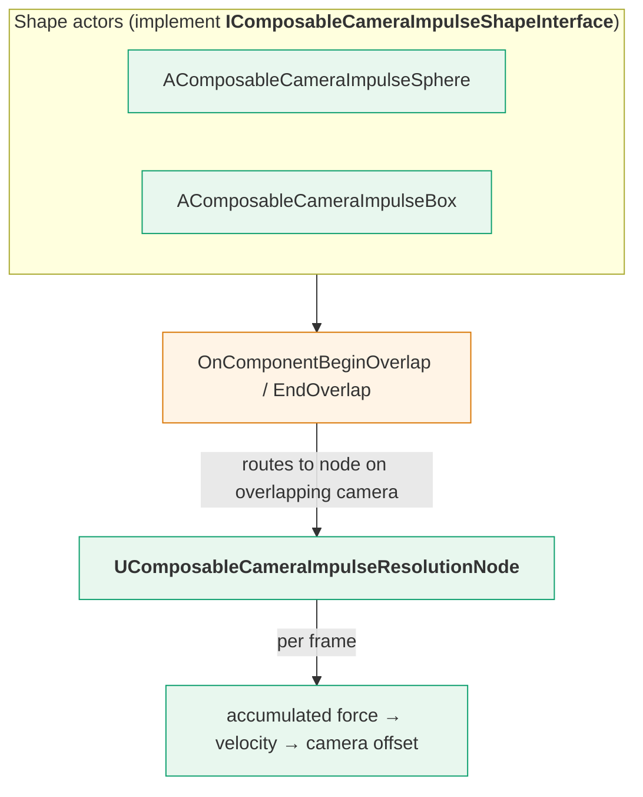

# Impulse System

The **impulse system** lets level-placed volumes push the camera around. Drop a `AComposableCameraImpulseSphere` or `AComposableCameraImpulseBox` in the world, give it a force curve, and any camera whose node chain contains a `UComposableCameraImpulseResolutionNode` will be nudged by the volume's force field while it's inside the bounds.

Typical uses:

- **Wind tunnels** — a long box with constant axial force pushes the camera sideways as the player runs through.
- **Explosive shockwaves** — a short-lived sphere spawned at the explosion origin with a strong, quickly-decaying force.
- **Environmental hazards** — magnetic fields, gravity wells, supernatural "pushback" zones in boss arenas.

The system is intentionally small: two shape actors, one resolution node, one interface. There is no scripting layer — shapes register themselves via collision overlap, and the node accumulates their forces each frame.

## Architecture



The three pieces cooperate like this:

1. Each shape actor holds a primitive component (sphere or box) and implements `IComposableCameraImpulseShapeInterface`. The interface declares three virtuals: `GetForce(CameraPosition)`, `GetOrigin()`, and `GetSelf()`.
2. The shape's primitive has `OnComponentBeginOverlap` / `OnComponentEndOverlap` delegates wired to the interface's default `BindToOnComponentBeginOverlap` / `EndOverlap` hooks. These hooks check whether the overlapping actor is a `AComposableCameraCameraBase`, find the camera's `UComposableCameraImpulseResolutionNode` (if any), and call `AddImpulseShape(this)` / `RemoveImpulseShape(this)` on it.
3. The resolution node keeps a `TArray<TScriptInterface<IComposableCameraImpulseShapeInterface>>` of currently-overlapping shapes. Each frame it calls `GetForce(CameraPosition)` on each shape, sums the results, and feeds the total through a velocity interpolator and a damping term to produce a pose delta.

The cameras **opt in** by including the resolution node. Cameras without it are invisible to the shape system — overlaps still fire, but `AddImpulseShape` is a no-op for them.

## The shapes

### `AComposableCameraImpulseSphere`

A radial impulse source. Force points from the sphere's origin outward toward the camera — so the camera gets pushed *away* from the center. Force magnitude is sampled from `ForceCurve` indexed by distance to the center.

| Field | Type | Purpose |
|---|---|---|
| `Radius` | `float` (default 100) | Radius of the overlapping sphere component. Editing this in the editor auto-syncs the underlying `USphereComponent`. |
| `ForceCurve` | `FRuntimeFloatCurve` | Distance → force magnitude. Practically `F(0)` should be largest and `F(Radius)` should drop to zero. |

The shape is marked `Placeable, NotBlueprintable` — drop it into levels from the **Place Actors** panel, tune it in the details panel, and don't bother subclassing it. If you need custom force logic, author a new shape class (see below).

### `AComposableCameraImpulseBox`

An axis-aligned box impulse source with a configurable reference origin. This is the more flexible of the two — the `DistanceType` enum decides what "distance" means inside the box:

| `DistanceType` | What "origin" means for force computation |
|---|---|
| `BoxOrigin` | The box's center. Force radiates from the center like a sphere, just clipped to a box shape. |
| `XAxis` | The camera's position projected onto the box's X axis. Force points perpendicular to that axis — good for wind tunnels aligned along X. |
| `YAxis` | Same, projected onto the Y axis. |
| `ZAxis` | Same, projected onto the Z axis. |
| `XYPlane` | Projected onto the XY plane. Force pushes along Z — good for vertical updrafts. |
| `XZPlane` | Projected onto the XZ plane. Force pushes along Y. |
| `YZPlane` | Projected onto the YZ plane. Force pushes along X. |

| Field | Type | Purpose |
|---|---|---|
| `DistanceType` | `EComposableCameraImpulseBoxDistanceType` | How the reference origin is computed. See the table above. |
| `ForceCurve` | `FRuntimeFloatCurve` | Distance → force magnitude. Unlike the sphere there's no max-distance constraint — the camera is inside the box, and the curve decides how far along the axis/plane counts as "strong". |

Same `Placeable, NotBlueprintable` flags as the sphere. You resize the box via the `UBoxComponent` itself in the editor.

### `IComposableCameraImpulseShapeInterface` — writing your own shape

The interface is the plugin's extension point. Implement it on an actor that also owns an overlap-capable primitive component, wire the primitive's begin/end overlap delegates to the interface's `BindTo…` hooks, and your shape participates in the system.

The three required overrides:

```cpp
virtual FVector GetForce(const FVector& CameraPosition) = 0;
virtual FVector GetOrigin() = 0;
virtual AActor* GetSelf() = 0;
```

- `GetForce(CameraPosition)` — return the world-space force vector for the given camera position. Called every frame while the camera is inside.
- `GetOrigin()` — return the reference origin in world space. Used for debug visualization and some interpolation heuristics.
- `GetSelf()` — return `this`. Boilerplate because `IInterface` has no concept of the owning actor.

The begin/end overlap hooks are already implemented as non-pure virtuals on the interface with the correct behavior — you don't need to override them unless you want to change how cameras are detected.

## The node — `UComposableCameraImpulseResolutionNode`

The node is what turns "currently overlapping a shape" into "camera moves". It runs once per frame on the camera that owns it.

| Field | Type | Purpose |
|---|---|---|
| `VelocityDamping` | `float` (default 1.0) | Divisor applied to the accumulated force. Larger values mean a smaller positional response to the same force. |
| `Interpolator` | `UComposableCameraInterpolatorBase*` (instanced) | How the camera's velocity ramps toward the target. Typical choice: a spring-damper or IIR interpolator. |

A camera gets an impulse node through the graph editor like any other node — drop it into the camera type asset and wire it into the evaluation chain. You usually put it **after** the pose-producing nodes (pivot, offset, look-at) and **before** final constraints (collision push, screen-space constraints), so the impulse offset is clamped by collision if the shape would otherwise push the camera through a wall.

!!! note "One resolution node per camera"
    The plugin only looks up a single `UComposableCameraImpulseResolutionNode` on the camera via `GetNodeByClass`. Adding two does not stack their effects — only one gets found and used. If you need two independent impulse paths, they must go through the same node.

## Putting it together — a worked example

**Scenario:** the player enters a fan-blown corridor. You want the camera (not the character — just the camera) to drift sideways while inside.

1. **Place the box.** Drop `AComposableCameraImpulseBox` in the corridor. Size the `UBoxComponent` to cover the walkable volume. Set `DistanceType = XAxis` if the corridor runs along X. Set `ForceCurve` to `(0 → 500, 100 → 100)` — strongest near the axis, fading with distance.
2. **Author the camera.** In your camera type asset, add `UComposableCameraImpulseResolutionNode` into the evaluation chain, between your pose nodes and any `CollisionPushNode`. Set `VelocityDamping = 1.0` (start neutral), pick a spring-damper `Interpolator` with a moderate stiffness.
3. **Collision setup.** Make sure the camera actor's collision is set to overlap the impulse box's collision channel. Without an overlap event, `AddImpulseShape` is never called.
4. **Test in PIE.** Walk the character through the corridor. The camera should drift sideways while inside and decay back to neutral on exit.

If the camera snaps instead of drifts, the interpolator stiffness is too high. If nothing happens, open `showdebug composablecamera` (see the [showdebug reference](../reference/showdebug.md)) and verify the impulse resolution node appears in the running camera's node list — if it does, the shape overlap is the problem; if it doesn't, the node isn't wired into the chain.

## Limits and sharp edges

- **Collision must overlap.** The system is purely overlap-driven. If the camera actor and the impulse shape's primitive don't generate an overlap event, nothing happens. `AComposableCameraCameraBase` ships with a reasonable default collision setup, but project-specific changes can break it.
- **One node class per camera.** `GetNodeByClass` finds the first match. Don't duplicate the resolution node.
- **Force is world-space.** `GetForce` returns world-space vectors. If you want camera-relative pushes, the shape (not the node) is responsible for the transform.
- **Transient cameras are fine.** Unlike modifiers, the impulse system has no transient-camera carve-out — a transient cinematic with an impulse node will respond to overlapping shapes.

## See also

- [`UComposableCameraImpulseResolutionNode`](../reference/api/nodes/UComposableCameraImpulseResolutionNode.md) — auto-generated field docs
- [`AComposableCameraImpulseSphere`](../reference/api/actors/AComposableCameraImpulseSphere.md), [`AComposableCameraImpulseBox`](../reference/api/actors/AComposableCameraImpulseBox.md)
- [`IComposableCameraImpulseShapeInterface`](../reference/api/uobjects-other/UComposableCameraImpulseShapeInterface.md)
- [Node Catalog](../reference/nodes.md#impulseresolutionnode) — catalog entry for the resolution node
